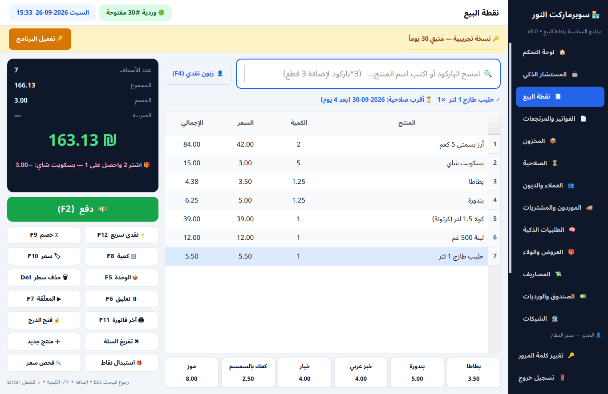
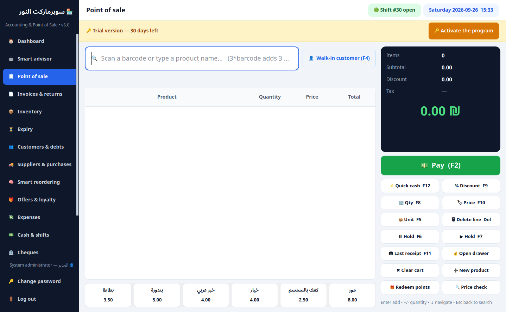
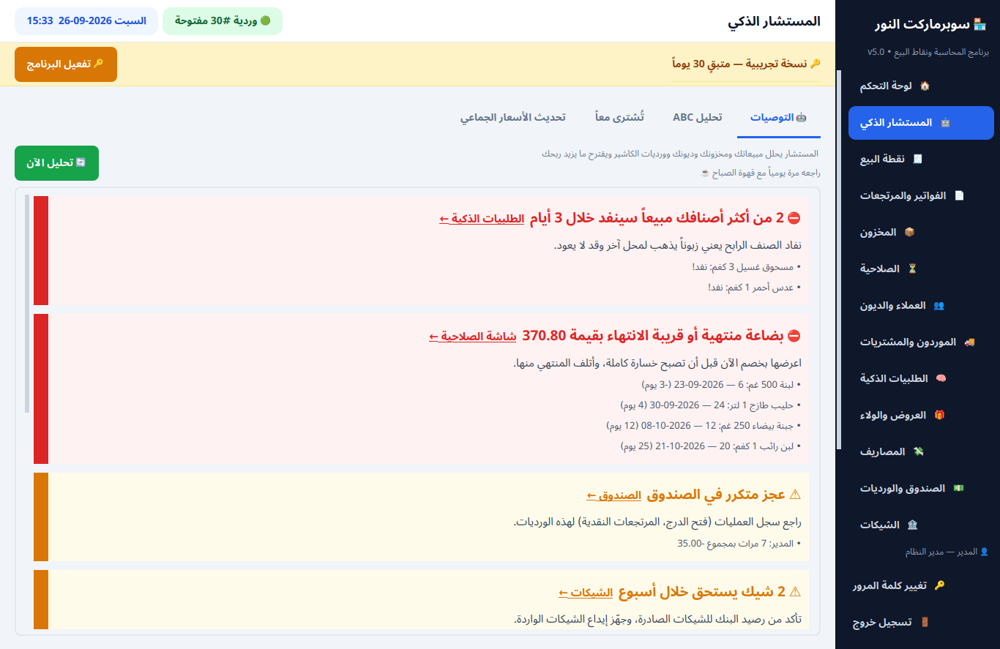
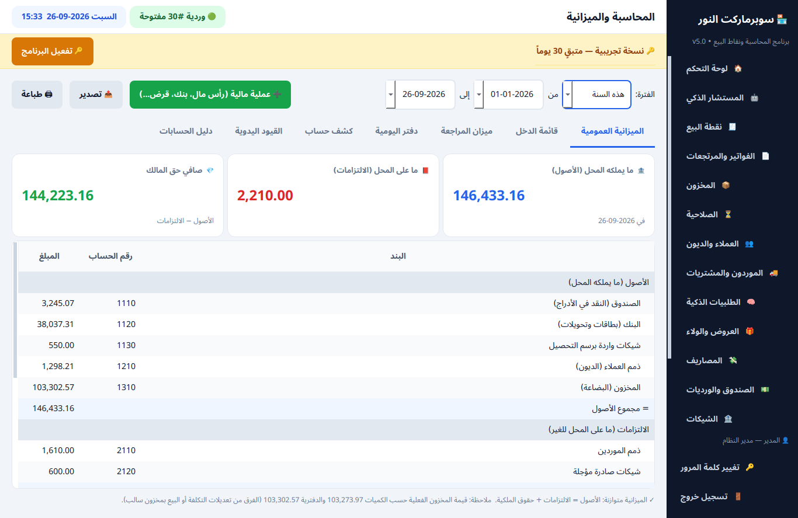
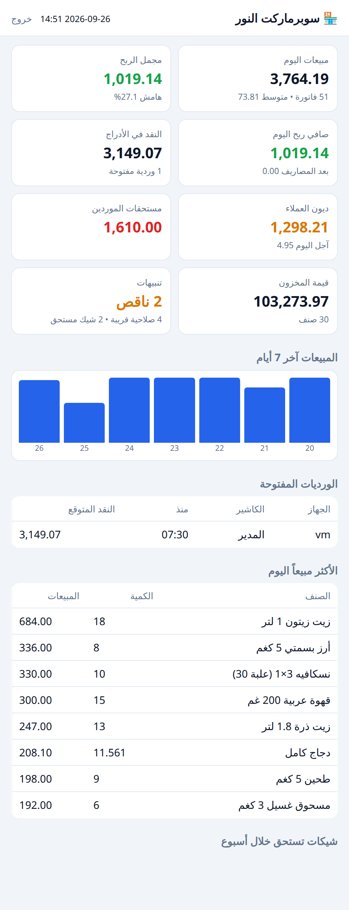

# برنامج المحاسبة ونقاط البيع — النسخة 5.0

> **English:** Point of sale + real accounting for shops and supermarkets, offline-first, Arabic & English. See the [English product sheet](docs/Product_Sheet_EN.md).

برنامج للدكاكين والمحلات الصغيرة والسوبرماركت يعمل بدون إنترنت، على جهاز واحد أو عدة أجهزة كاشير عبر شبكة المحل. يشمل: بيع سريع بالباركود والميزان والكرتونة، مخزون مع تواريخ الصلاحية، دفتر ديون العملاء مع تذكير واتساب، موردون ومشتريات، مصاريف، صندوق وورديات لكل جهاز، ودرج نقود، وتقارير أرباح حقيقية — **ومحاسبة كاملة بالقيد المزدوج (ميزانية عمومية وميزان مراجعة)، شيكات مؤجلة، عروض ونقاط ولاء، طلبيات ذكية، لوحة للمالك على الجوال، ونظام ترخيص للبيع التجاري.**



## التشغيل

```bash
pip install -r requirements.txt
python main.py
```

- أول دخول: المستخدم `admin` وكلمة المرور `admin` (سيطلب البرنامج تغييرها فوراً).
- **بيانات تجريبية** (30 منتجاً، كراتين، صلاحيات، عملاء، موردون، مبيعات شهر كامل) في مجلد منفصل:
  ```bash
  python tools/demo_data.py demo_data
  set SHOP_DATA_DIR=demo_data && python main.py        # لينكس/ماك: SHOP_DATA_DIR=demo_data python main.py
  ```
- **الترقية من النسخة 1 أو 2 أو 3:** انسخ ملف `data/accounting.db` القديم إلى مجلد `data`. يُرقّى تلقائياً عند أول تشغيل دون فقدان أي بيانات.

## 📚 الأدلة

| الدليل | لمن |
|---|---|
| [تقييم البرنامج وما تغيّر](docs/01_تقييم_البرنامج.md) | المطوّر |
| [المحاسبة ببساطة](docs/02_المحاسبة_ببساطة.md) | المطوّر وصاحب المحل (بدون خلفية محاسبية) |
| [دليل التدريب الشامل + خطة تدريب الزبائن](docs/03_دليل_التدريب.md) | المدرّب، المالك، المدير، الكاشير |
| [بطاقة الكاشير (للطباعة)](docs/04_بطاقة_الكاشير.md) | الكاشير |
| [دليل التسويق والبيع](docs/05_دليل_التسويق_والبيع.md) | المطوّر/المسوّق |
| [دليل المطوّر: البناء والترخيص والتركيب](docs/06_دليل_المطور_للبناء_والترخيص.md) | المطوّر |
| [Product sheet (English)](docs/Product_Sheet_EN.md) | الزبائن خارج البلاد العربية |

---

## الجديد في النسخة 5.0

| الميزة | الوصف |
|---|---|
| 🤖 **المستشار الذكي** | توصيات يومية مرتبة حسب الخطورة مع رابط للإجراء: خسارة في التسعير، نفاد الرابح، راكد، زبائن توقفوا، ديون متأخرة، خصومات كاشير، عجز متكرر، اتجاه المبيعات، ذروة البيع، أصناف تُشترى معاً |
| 📈 **تحليل ABC وتحديث الأسعار الجماعي** | تصنيف الأصناف حسب مساهمتها، وضبط الأسعار لهامش مستهدف مع تقريب ومعاينة |
| 📶 **البيع أثناء انقطاع الشبكة** | الكاشير الفرعي يبيع من نسخة محلية إذا توقف الجهاز الرئيسي، والترحيل تلقائي وبلا تكرار |
| 🖥 **شاشة الزبون** | الأصناف والإجمالي والتوفير والباقي على الشاشة الثانية |
| 🏷 **أسعار الجملة** | سعر جملة للصنف وعميل بمستوى جملة |
| 🧾 **ضريبة المدخلات وإقرار الضريبة** | المشتريات بضريبتها، وتقرير المخرجات − المدخلات |
| 🌍 **واجهة إنجليزية كاملة** | +1,200 نص مترجم، اتجاه من اليسار لليمين، فواتير ورسائل بالإنجليزية، عملات ودول عالمية |

| English interface | Smart advisor |
|---|---|
|  |  |

---

## الجديد في النسخة 4.0



| الميزة | الوصف |
|---|---|
| 📚 **محاسبة بالقيد المزدوج** | كل عملية تتحول تلقائياً لقيد متوازن: ميزانية عمومية، قائمة دخل، ميزان مراجعة، دفتر يومية، كشف أي حساب، وعمليات مالية جاهزة (رأس مال، بنك، قرض، معدات) |
| 🏦 **الشيكات المؤجلة** | واردة من العملاء وصادرة للموردين، تنبيه الاستحقاق، «صُرف» أو «راجع» مع إعادة الدين تلقائياً |
| 🎁 **العروض التلقائية** | اشترِ X واحصل على Y، كمية بسعر ثابت، خصم % على صنف أو فئة — تُطبَّق وحدها في نقطة البيع |
| ⭐ **نقاط الولاء** | كسب واستبدال، وإلغاء النقاط مع المرتجع، وتظهر على الفاتورة |
| 🧠 **الطلبيات الذكية** | كميات مقترحة حسب سرعة البيع مقرّبة للكرتونة، إرسال للمورد بواتساب أو تحويل لفاتورة مشتريات |
| ↩ **مرتجع للمورد** | يخصم البضاعة من المخزون ومن حساب المورد |
| 📱 **لوحة المالك على الجوال** | `http://عنوان-الجهاز:8765/owner` — مبيعات، ربح، نقد الأدراج، نواقص، شيكات |
| 📨 **ملخص اليوم بواتساب** | بضغطة من لوحة التحكم |
| 🔍 **فحص سعر** | في نقطة البيع بدون إضافة للفاتورة |
| 🔑 **الترخيص** | تجربة 30 يوماً، مفاتيح تفعيل موقّعة RSA لكل جهاز، باقات بعدد الأجهزة واشتراكات |
| 🧭 **معالج الإعداد الأول** | تجهيز المحل في دقيقة |
| 🔐 **أمان الشبكة** | الخادم يتحقق من الصلاحيات بنفسه (سُدّت ثغرة كانت تسمح لكاشير على جهاز فرعي بإنشاء مدير) |
| 📊 **ربح أدق** | تقرير الأرباح يشمل عجز/زيادة الصندوق والتسويات، ويطابق قائمة الدخل |

<p align="center"></p>

---

## الجديد في النسخة 3.0

### 🖧 عدة نقاط بيع على نفس البيانات
1. في الجهاز الرئيسي: **الإعدادات ← هذا الجهاز والشبكة ← إعداد الشبكة** واختر «جهاز رئيسي». يظهر لك **العنوان ورمز الربط**.
2. في كل جهاز كاشير: اختر «نقطة بيع فرعية» وأدخل العنوان ورمز الربط، واضغط «اختبار الاتصال».
3. أعد تشغيل البرنامج على الأجهزة.

- كل عملية تُنفَّذ على الجهاز الرئيسي داخل معاملة واحدة: لا تضارب في المخزون ولا تكرار في أرقام الفواتير.
- **لكل جهاز وردية وصندوق مستقل**، وتقرير «المبيعات حسب الجهاز».
- الطابعة ودرج النقود من إعدادات كل جهاز.
- يمكن تشغيل الجهاز الرئيسي بدون واجهة: `python tools/server_headless.py`.
- يعمل عبر راوتر المحل فقط، بدون إنترنت. أول مرة قد يسأل جدار حماية ويندوز: اختر «سماح».

### 📦 وحدات متعددة للصنف (حبة / علبة / كرتونة)
- في بطاقة المنتج أضف وحدات مثل: كرتونة = 24 حبة بسعر 60 وباركود خاص.
- مسح باركود الكرتونة يبيعها كاملة ويخصم 24 من المخزون. `F5` يبدّل وحدة أي سطر في السلة.
- المشتريات أيضاً بالكرتونة: البرنامج يحوّلها لحبات ويحسب تكلفة الحبة.

### ⏳ تواريخ الصلاحية والدفعات
- أدخل تاريخ الصلاحية مع فاتورة المشتريات (عمود «الصلاحية») أو عند إضافة كمية.
- البيع يخصم تلقائياً من **الدفعة الأقرب انتهاءً أولاً (FEFO)**.
- شاشة **الصلاحية**: المنتهي، ما ينتهي خلال أسبوع، والقريب، مع قيمته. وفيها زر إتلاف يسجل الكمية خسارة، وتصدير القائمة لإرجاعها للمورد.
- تنبيه في نقطة البيع عند مسح صنف قريب الانتهاء أو منتهٍ، وخيار لمنع بيعه.
- **خسائر المخزون** (تالف، منتهي، سرقة، عجز جرد) تظهر في قائمة الأرباح وتُطرح من صافي الربح.

### 💰 درج النقود
يفتح تلقائياً عند البيع النقدي، وله زر «فتح الدرج» (مع تسجيل في سجل العمليات). طرق التوصيل: عبر الطابعة الحرارية المثبتة (ويندوز/لينكس)، أو طابعة شبكة (IP:9100)، أو منفذ COM.

### 📱 واتساب
- «تذكير واتساب» يفتح المحادثة مع العميل والرسالة جاهزة، ويكفي الضغط على إرسال.
- **تذكير جماعي للمدينين**: تنتقل بين العملاء واحداً تلو الآخر.
- إرسال أي فاتورة للزبون من سجل الفواتير.
- الأرقام المحلية (059...) تُحوَّل تلقائياً للصيغة الدولية (970 افتراضياً، قابل للتغيير).
- ملاحظة: الإرسال الآلي الكامل بدون ضغط زر يحتاج اشتراك WhatsApp Business API المدفوع.

### ☁ نسخة احتياطية سحابية
اختر مجلداً داخل Google Drive أو OneDrive من إعدادات النسخ الاحتياطي، وستُنسخ إليه كل نسخة تلقائياً. برنامج المزامنة يرفعها للسحابة بنفسه.

---

## المميزات الأساسية

### 🧾 نقطة البيع
| المفتاح | الوظيفة | المفتاح | الوظيفة |
|---|---|---|---|
| Enter | إضافة / دفع إن كان البحث فارغاً | F2 | الدفع |
| F12 | نقدي سريع | F4 | اختيار عميل |
| F5 | تبديل الوحدة (حبة/كرتونة) | F6 / F7 | تعليق / استرجاع فاتورة |
| F8 | الكمية | F9 | خصم |
| F10 | تغيير السعر | F11 | إعادة طباعة آخر فاتورة |
| + / − | كمية السطر | Delete | حذف السطر |
| `3*باركود` | 3 قطع مرة واحدة | باركود الميزان | يُقرأ الوزن تلقائياً |

إضافة لذلك: دفع نقدي أو بطاقة أو آجل أو مختلط مع حساب الباقي، أزرار سريعة للخبز والخضار، إذن مدير فوري للخصم الكبير وتغيير السعر وتجاوز حد الدين، وطباعة حرارية بعرض 58 أو 80 مم.

### 📦 المخزون
فئات، هامش ربح، جرد، حركة الصنف، الدفعات والصلاحية، ملصقات أسعار بالباركود، واستيراد وتصدير Excel.

### 👥 العملاء والديون
بيع آجل، حد دين، كشف حساب برصيد تراكمي، تسديدات، تسوية، طباعة الكشف، وتذكير واتساب.

### 🚚 الموردون والمشتريات
فواتير مشتريات بالحبة أو الكرتونة ومع الصلاحية، متوسط التكلفة المرجّح، دفع كامل أو جزئي، وكشف حساب.

### 💵 الصندوق والورديات
وردية مستقلة لكل جهاز، إدخال وسحب نقدي، إغلاق بعدّ النقود بالفئات مع كشف العجز والزيادة، وتقرير Z.

### 📊 التقارير
الأرباح والخسائر (بعد المرتجعات والضريبة والتكلفة والمصاريف وخسائر المخزون)، المبيعات اليومية، الفئات، الأكثر مبيعاً، الراكدة، ساعات الذروة، الكاشير، الجهاز، الديون، تقييم المخزون، وسجل العمليات.

### 🔐 المستخدمون والأمان
أدوار (مدير نظام، مدير محل، كاشير)، كلمات مرور مشفّرة، سجل عمليات، ونسخ احتياطي يومي وعند الإغلاق.

## تحويله إلى exe (ويندوز)
```bat
python tools\license_tool.py init     (مرة واحدة: مفاتيح الترخيص)
build_exe.bat
```
التفاصيل في [دليل المطوّر](docs/06_دليل_المطور_للبناء_والترخيص.md).

## الاختبارات
```bash
pip install pytest
python -m pytest tests
```
56 اختباراً، منها اختبار البيع أثناء توقف الجهاز الرئيسي ثم الترحيل بلا تكرار، واختبار الواجهة الإنجليزية كاملة، و اختبار شبكة حقيقي يشغّل جهازاً رئيسياً ونقطة بيع فرعية، واختبارات تتحقق أن المدين = الدائن والميزانية متوازنة ودفتر الأستاذ يطابق الديون والصندوق والمخزون بعد يوم عمل كامل.

## هيكل المشروع
```
accounting_app/
├── main.py                 التشغيل (مستقل / رئيسي / فرعي)
├── core/                   المنطق المحاسبي (بدون واجهة)
│   ├── db.py               الجداول والترقية والمعاملات
│   ├── sales.py            الفواتير والمرتجعات والوحدات
│   ├── products.py         المنتجات، الوحدات، الدفعات والصلاحية، الجرد
│   ├── customers.py  suppliers.py  expenses.py  shifts.py  reports.py
│   ├── remote.py           الخادم والعميل لتعدد نقاط البيع
│   ├── config.py           إعدادات هذا الجهاز (data/terminal.json)
│   ├── context.py          المستخدم والجهاز الحاليان
│   ├── drawer.py           درج النقود (ESC/POS)
│   ├── whatsapp.py         رسائل وروابط واتساب
│   ├── ledger.py           القيد المزدوج والميزانية (4.0)
│   ├── cheques.py  promotions.py  loyalty.py  reorder.py   (4.0)
│   ├── license.py  vendor.py  owner_web.py                 الترخيص، بيانات المزوّد، لوحة الجوال (4.0)
│   ├── insights.py  offline.py  i18n.py                     المستشار الذكي، البيع بدون شبكة، الترجمة (5.0)
│   ├── receipts.py  barcode.py  backup.py  auth.py  audit.py  settings.py  utils.py
├── ui/                     الواجهات (PySide6)
├── i18n/                   ملفات الترجمة (en.json)
├── tests/                  الاختبارات
├── tools/                  بيانات تجريبية، خادم بدون واجهة، لقطات شاشة، أداة مفاتيح الترخيص
└── data/                   قاعدة البيانات والنسخ وإعدادات الجهاز (تُنشأ تلقائياً)
```
