# برنامج المحاسبة ونقاط البيع

> **English:** Point of sale + real double-entry accounting for shops, supermarkets and chains — offline-first, Arabic & English, with a built-in financial auditor, an assistant you can ask in plain language, cash-flow forecasting, a Ramadan planner and a zakat calculator. Free forever plan; first month on the full Max plan. See the [English product sheet](docs/Product_Sheet_EN.md).

**برنامج بيع ومحاسبة كامل للدكاكين والسوبرماركت والسلاسل:** يعمل بدون إنترنت، يبيع بسرعة، يتذكر الديون والأقساط والشيكات والصلاحية، يصرف الرواتب، يجمع الفروع في تقرير واحد، ويدقق حساباته بنفسه — **وتسأله بلهجتك فيجيبك من أرقامك، ويتوقع سيولتك، ويجهّزك لرمضان، ويحسب زكاتك.**

> 🌱 **مجاني للأبد** • ⚡ بلس • 💎 برو • 👑 ماكس — **وأول شهر ماكس كامل مجاناً.** البيع لا يتوقف أبداً.
>
> 🌐 **صفحة البرنامج:** https://abdulrahmanahmedelabed-prog.github.io/shopping/

[](https://github.com/abdulrahmanahmedelabed-prog/shopping/releases/latest)
[](docs/01_تقييم_البرنامج.md)
[](#-الباقات)
[](https://github.com/abdulrahmanahmedelabed-prog/mee/actions/workflows/windows.yml)


## ⬇️ تحميل البرنامج

| | |
|---|---|
| 🖥 **ويندوز (ملف التثبيت)** | [**ShopAccounting-Setup.exe**](https://github.com/abdulrahmanahmedelabed-prog/shopping/releases/latest/download/ShopAccounting-Setup.exe) |
| 🗂 **ويندوز بدون تثبيت** | [ShopAccounting-Portable.zip](https://github.com/abdulrahmanahmedelabed-prog/shopping/releases/latest/download/ShopAccounting-Portable.zip) — فك الضغط وشغّل `ShopAccounting.exe` |
| 📱 **أندرويد** | [ShopPOS-android.apk](https://github.com/abdulrahmanahmedelabed-prog/shopping/releases/latest/download/ShopPOS-android.apk) — تطبيق الجوال للموظفين وصاحب المحل (يجد جهاز المحل تلقائياً) |
| 🍏 **آيفون وأي جوال** | لوحة المالك والمتجر من المتصفح، وتُضاف للشاشة الرئيسية كتطبيق |

كل الإصدارات في صفحة [**Releases**](https://github.com/abdulrahmanahmedelabed-prog/shopping/releases). عند التثبيت قد يظهر «ويندوز حمى جهازك»: اضغط «معلومات إضافية» ← «تشغيل على أي حال». بعد التثبيت افتح **«نسخة التدريب»** من قائمة ابدأ: سوبرماركت كامل بتاريخ 3 سنوات (الدخول `admin` / `admin`).

## 🎬 شاهد البرنامج في دقيقة

| فيديو طولي (ريلز، تيك توك، حالة واتساب) | فيديو عرضي (يوتيوب، فيسبوك) |
|---|---|
| [▶ ad_vertical.mp4](marketing/ad/ad_vertical.mp4) | [▶ ad_horizontal.mp4](marketing/ad/ad_horizontal.mp4) |

<p align="center">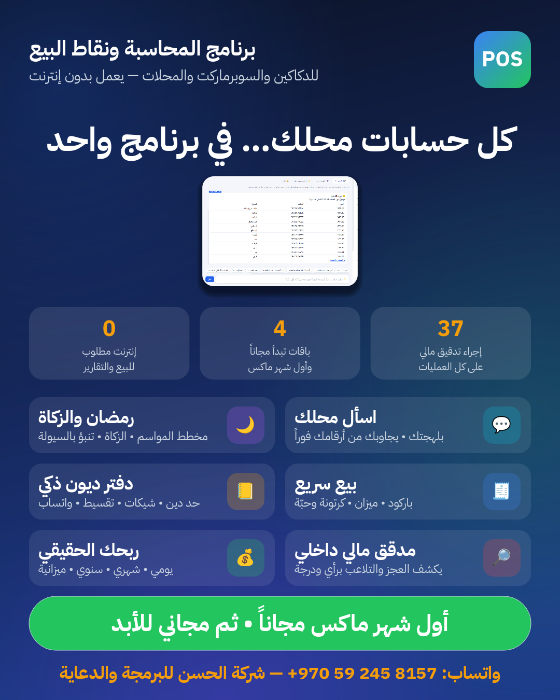 &nbsp; 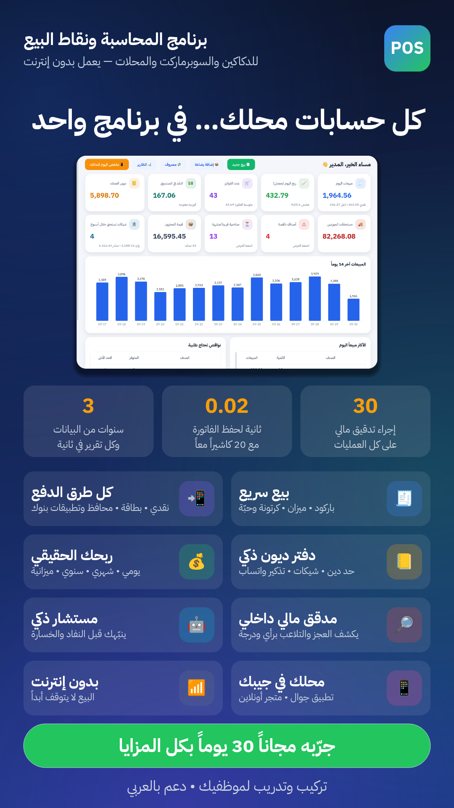</p>

الإنفوجرافيك جاهز بثلاثة مقاسات: [منشور](marketing/infographic/post.png) • [قصة / حالة واتساب](marketing/infographic/story.png) • [ورقة A4 للطباعة](marketing/infographic/flyer_a4.png)

## 🧭 مساعد المحل

| | |
|---|---|
| 💬 **اسأل محلك** | اكتب «كم ربحت الشهر الماضي؟» أو «مين عليه دين؟» أو «كم باقي حليب؟» — بالفصحى أو العامية أو الإنجليزية — فيجيبك فوراً من بياناتك، **بدون إنترنت**، ومن أي شاشة بـ Ctrl+K |
| 🔮 **التنبؤ والسيولة** | مبيعات الثلاثين يوماً القادمة يوماً بيوم، والنقد المتوقع بالرواتب والشيكات والمشتريات، وتحذير قبل أن ينقص النقد |
| 🌙 **مخطط رمضان والمواسم** | بالتقويم الهجري: متى يبدأ الموسم، واطلب قبل أي تاريخ، وكم ارتفع بيع كل صنف في الموسم الماضي، والطلبية المقترحة |
| 🕌 **حاسبة الزكاة** | زكاة عروض التجارة من الدفاتر: النقد والبضاعة والديون المرجوّة ناقص الديون الحالّة، بالنصاب والحَوْل، وتقرير للطباعة |

| اسأل محلك | مخطط رمضان |
|---|---|
| 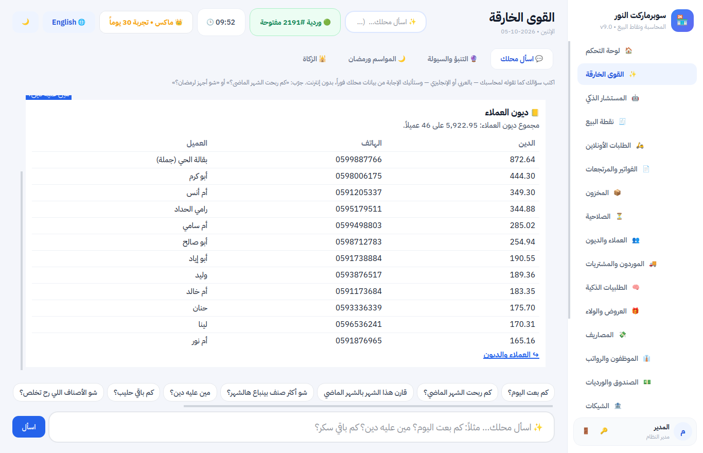 | 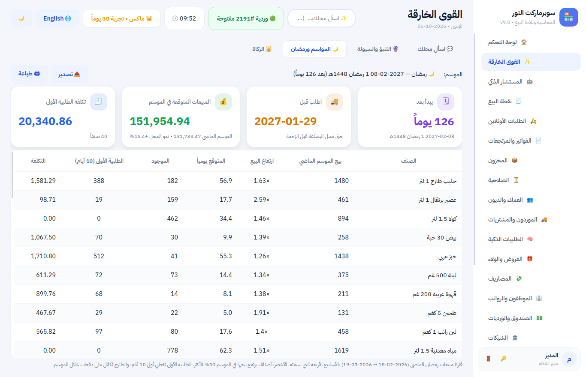 |
| **التنبؤ والسيولة** | **الزكاة** |
| 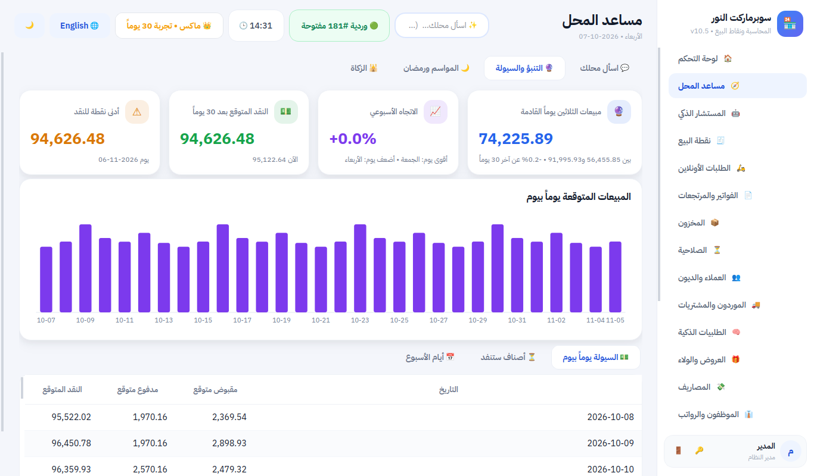 | 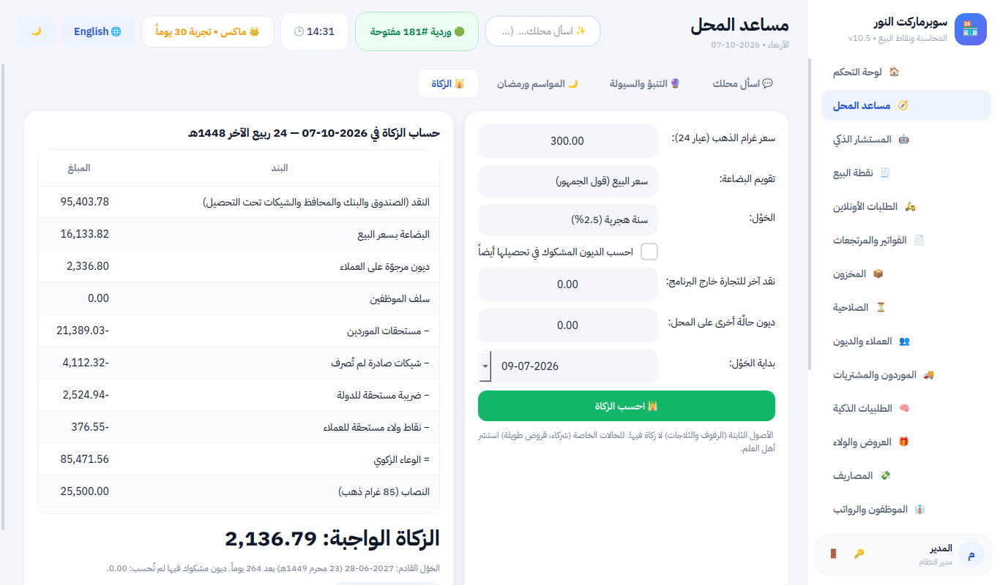 |

## 🏆 أبرز ما يميّزه

- **محاسب ومدقق آليان:** إهلاك الأصول والتدفقات النقدية وإقفال الشهر بضغطة تقفل الدفاتر، و47 إجراء تدقيق يعمل وحده كل يوم على كل العمليات، مع **ختم ضد العبث** يكشف أي فاتورة عُدّلت أو حُذفت من خارج البرنامج.
- **محاسبة بمعايير المحاسب القانوني:** قيد مزدوج كامل، ميزانية وقائمة دخل مقارنة وإقرار ضريبي، **12 مؤشراً مالياً** بشرح بسيط، و**مطابقة البنك**، وتقرير الأرباح يطابق الدفاتر حتى الأغورة.
- **فوترة إلكترونية مرتبطة (اختيارية):** «فاتورة» السعودية المرحلة الثانية بالتوقيع الرقمي وسلسلة البصمات وQR المرحلة الثانية، ونظام الفوترة الوطني الأردني JoFotara — تُرسل في الخلفية والبيع لا يتوقف.
- **الدفع الحديث:** محافظ إلكترونية وتطبيقات بنوك برمز QR، بطاقة، آجل، تقسيط، عملات أخرى — والمرتجع يُعاد بنفس طريقة الدفع.
- **الموظفون والرواتب والأقساط:** رواتب وسلف تُخصم تلقائياً وقسيمة راتب، وأقساط للزبائن بمواعيد وتذكير.
- **من الدكان إلى السلسلة:** وضع مبسّط للدكان، عدة كاشيرات للسوبرماركت، وتقرير واحد لكل الفروع.
- **واجهة عصرية بطابع تطبيقات الجوال:** تتكيف مع أي شاشة، **وضع داكن وفاتح وتلقائي** بألوان واضحة، تنتقل بين العربية والإنجليزية في أقل من ثانية، و**شعار محلك** في كل شاشة وكل مطبوع.
- **لا يتوقف البيع أبداً:** بدون إنترنت يعمل، وعند انتهاء الاشتراك يعود للمجانية ويستمر البيع — بياناتك ملكك.
- **مُختبر تحت الضغط:** 20 كاشيراً معاً على 3 سنوات من بيانات سوبرماركت، وانقطاع الكهرباء أثناء البيع — بلا فاتورة ضائعة أو مكررة.

## 🧩 المزايا

| | |
|---|---|
| 🧾 **البيع** | باركود، ميزان، حبة وكرتونة، عروض تلقائية، نقاط ولاء، أسعار جملة، تعليق الفواتير، **فاتورة بلا كسور**، شاشة الزبون، وضع اللمس، جاهز لجهاز البطاقة البنكي، **فوترة إلكترونية (السعودية والأردن)** |
| 📲 **الدفع الإلكتروني** | المحافظ وتطبيقات البنوك: رقم الحساب ورمز QR، رقم العملية، تقرير مطابقة، حساب مستقل في الميزانية |
| 📦 **المخزون** | الصلاحية (يبيع الأقرب انتهاءً أولاً)، جرد، طلبيات ذكية للموردين عبر واتساب، ملصقات أسعار و**طابور ملصقات تلقائي** لكل سعر تغيّر، مرتجع للمورد مع ضريبته |
| 👥 **الديون والأقساط** | دفتر لكل زبون، حد دين، تذكير واتساب، **تقسيط بجدول مواعيد**، شيكات مؤجلة، استيراد الدفتر القديم من Excel |
| 💰 **الأرباح والمحاسبة** | الربح الحقيقي، ملخص يومي وأسبوعي وشهري وسنوي، ميزانية وقائمة دخل مقارنة و**تدفقات نقدية**، **مؤشرات مالية**، **مطابقة البنك**، **أصول ثابتة بإهلاك تلقائي**، **إقفال الشهر بضغطة** وقفل الدفاتر، إقرار الضريبة |
| 🔎 **التدقيق المالي** | 47 إجراءً **يومياً وتلقائياً**: مطابقة الدفاتر، تسلسل الفواتير، مؤشرات التلاعب، أعمار الديون، بنفورد، **ختم ضد العبث**، قفل الفترات — رأي ودرجة وتقرير |
| 👔 **الموظفون** | رواتب شهرية، مكافآت وخصومات، سلف تُخصم من الراتب، قسيمة راتب لأي شهر، كشف الموظف، الموظفون السابقون |
| 🏬 **الفروع** | كل فرع مستقل، والمالك يرى الفروع كلها ومجموعها في تقرير واحد من Google Drive |
| 🤖 **المستشار الذكي** | تنبيه يومي بما يخسّر المحل: صنف سينفد، بيع بخسارة، بضاعة راكدة، أقساط متأخرة |
| 🔒 **الرقابة والأمان** | ورديات وعدّ صندوق، إذن المدير، سجل العمليات، نسخ احتياطي يومي ونسخة في Google Drive، فحص سلامة البيانات، صلاحيات يتحقق منها جهاز المحل وحماية من تخمين كلمات المرور |
| 📱 **الجوال والأونلاين** | تطبيق أندرويد بتبويبات: أرقام اليوم، الأسعار والجرد بالكاميرا، النواقص، الزبائن والديون مع تذكير واتساب، تجهيز الطلبات الأونلاين، اسأل محلك؛ ولوحة المالك، ومتجر أونلاين بلا عمولة، وملخص اليوم بواتساب |
| 🧰 **أدوات يومية** | **آلة حاسبة** في كل شاشة تُدرج النتيجة في الخانة، **الحساب داخل خانات المبالغ** (`12*3.5+4`، `100+16%`)، **حاسبة التسعير** من التكلفة إلى سعر البيع شاملاً الضريبة والعكس، **ملاحظات وتذكيرات** متكررة ومشتركة، و**تحديث بضغطة واحدة** |
| 🖥 **لكل محل** | يعمل بدون إنترنت، عدة كاشيرات، شاشات صغيرة ولمس، عربي و English (**وأسماء الأصناف تُترجم تلقائياً**)، وضع داكن، شعار المحل في كل مكان |

## 💎 الباقات

| | 🌱 مجاني | ⚡ بلس | 💎 برو | 👑 ماكس |
|---|---|---|---|---|
| **السعر السنوي** | **0$ للأبد** | **290$** في السنة | **890$** في السنة | **1,730$** في السنة |
| مثيله العالمي في القوة (سنوياً) | — | Square Plus ‏588$ | Lightspeed Core ‏1,788$ | Lightspeed Plus ‏3,468$ |
| أجهزة الكاشير | 1 | 2 | 5 | غير محدود |
| البيع، المخزون والصلاحية، الديون، البطاقات والمحافظ، الورديات، التقارير والضريبة، تطبيق الجوال لفحص الأسعار | ✅ | ✅ | ✅ | ✅ |
| المستشار الذكي، الطلبيات الذكية، العروض والولاء، الشيكات، التقسيط، الجرد من الجوال | | ✅ | ✅ | ✅ |
| المحاسبة والميزانية، التدقيق المالي، الرواتب، المتجر الأونلاين، لوحة المالك، الزكاة | | | ✅ | ✅ |
| اسأل محلك، التنبؤ والسيولة، مخطط المواسم ورمضان، الفروع | | | | ✅ |

**كل باقة بأقل من نصف سعر مثيلها العالمي.** **أول 30 يوماً: ماكس كامل مجاناً.** بعدها ينتقل للمجانية تلقائياً، والميزات المتقدمة تظهر بقفل 🔒 يشرح ما تقدمه. الترقية فورية بمفتاح تفعيل.

<p align="center">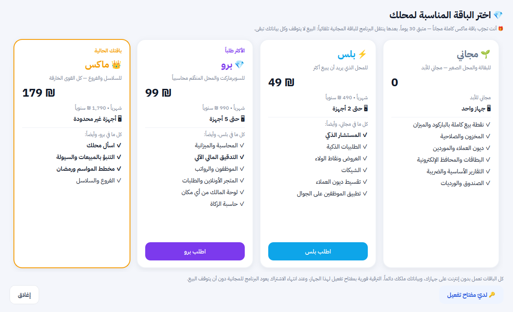</p>

## ⚖️ مقابل المنافسين

| | **برنامجنا** | Square | Lightspeed | Shopify POS | دفترة | قيود | Loyverse |
|---|---|---|---|---|---|---|---|
| السعر الشهري لمحل واحد | **0 / ~13$ / ~27$ / ~48$** | 0-149$ + عمولة كل بطاقة | 89-289$ | 89$ + اشتراك Shopify | 30-70$ | ~37-101$ | 0 + إضافات |
| يعمل كاملاً بدون إنترنت | ✅ | ➖ | ➖ | ➖ | ➖ | ❌ | ➖ |
| محاسبة + ميزانية + مدقق مالي آلي | ✅ | ❌ | ❌ | ❌ | ➖ بلا مدقق | ➖ بلا مدقق | ❌ |
| اسأل بالعربي العامي، تنبؤ بالسيولة، رمضان الهجري، الزكاة | ✅ | ❌ | ❌ | ❌ | ❌ | ❌ | ❌ |
| الديون والتقسيط والشيكات المؤجلة والمحافظ المحلية | ✅ | ❌ | ➖ | ❌ | ➖ | ➖ | ❌ |

المقارنة الكاملة مع 11 برنامجاً عربياً وعالمياً، بما فيها أين يتفوقون هم، والمصادر: [المقارنة مع المنافسين](docs/08_المقارنة_مع_المنافسين.md).

التفاصيل في [مزايا البرنامج](docs/00_مزايا_البرنامج.md).

## 📸 من داخل البرنامج

| لوحة التحكم | التدقيق المالي |
|---|---|
|  |  |
| **الدفع بالمحفظة الإلكترونية** | **تقسيط دين زبون** |
|  | 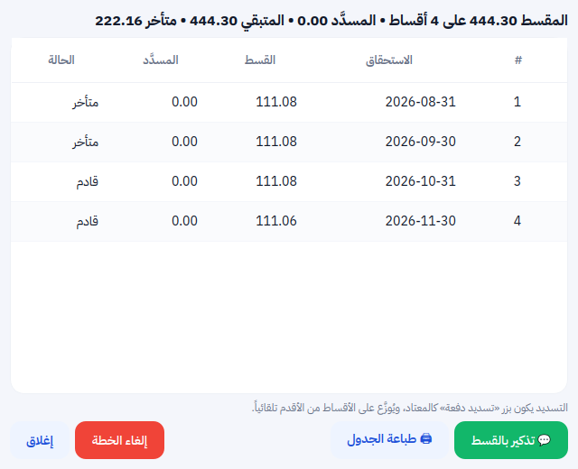 |
| **الموظفون والرواتب** | **تقرير الفروع** |
|  |  |
| **ملخص الفترات (3 سنوات)** | **مطابقة الدفع الإلكتروني** |
|  | 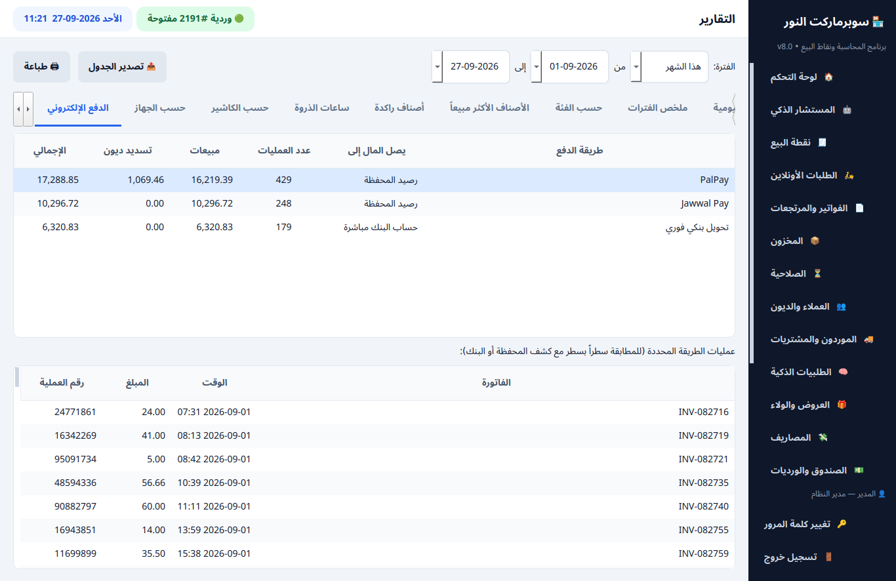 |
| **العملاء والديون** | **المخزون** |
|  | 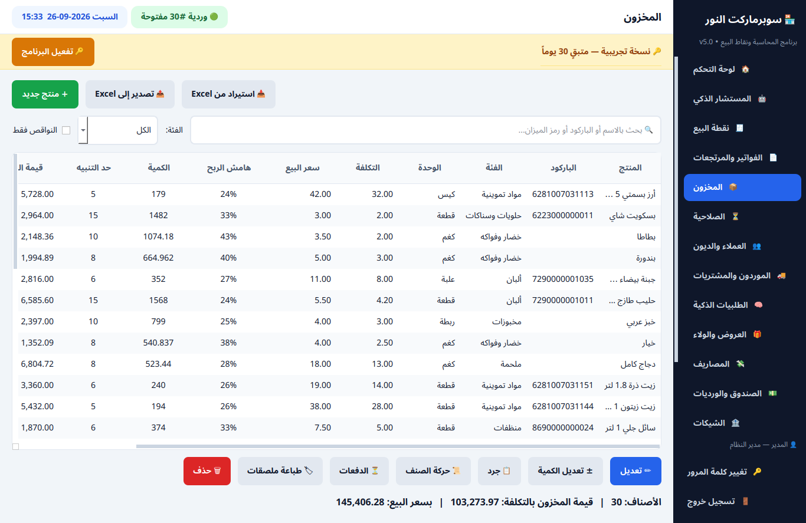 |
| **الواجهة الإنجليزية** | **المحاسبة والميزانية** |
|  |  |
| **التدفقات النقدية** | **الأصول الثابتة والإهلاك التلقائي** |
| 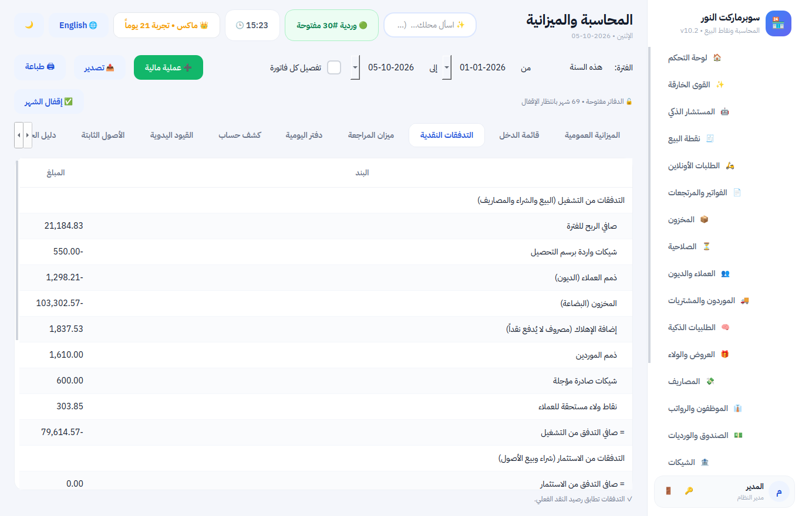 | 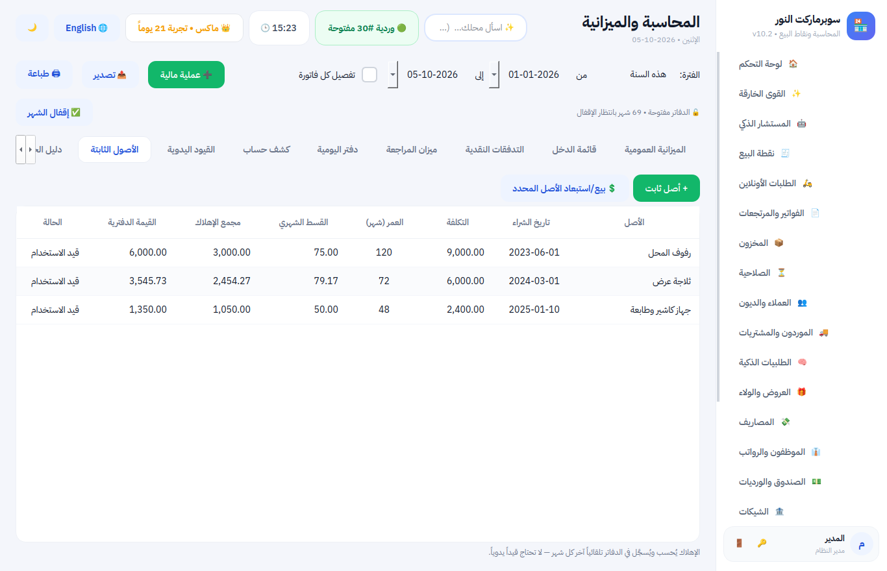 |
| **المخزون بالإنجليزية (أسماء مترجمة تلقائياً)** | **الباقات** |
| 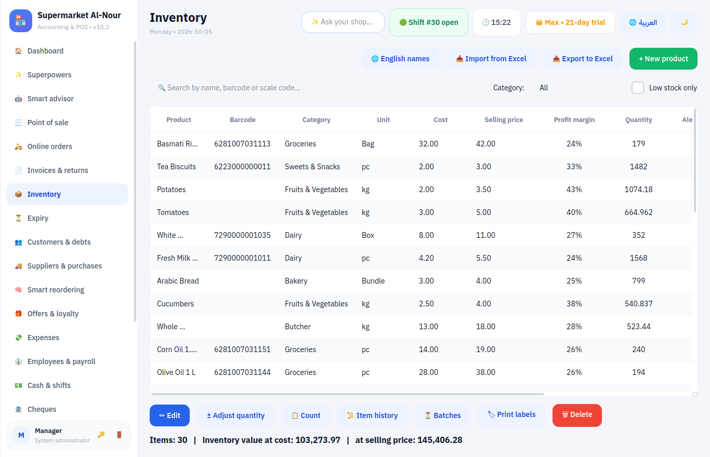 |  |
| **الوضع الداكن** | **نقطة البيع بالوضع الداكن** |
| 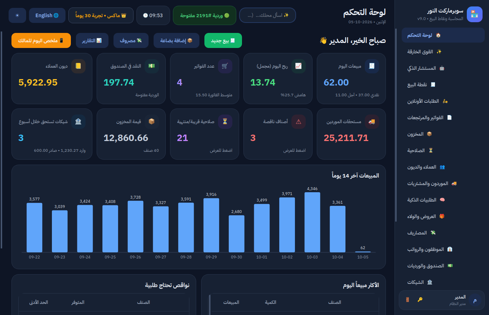 | 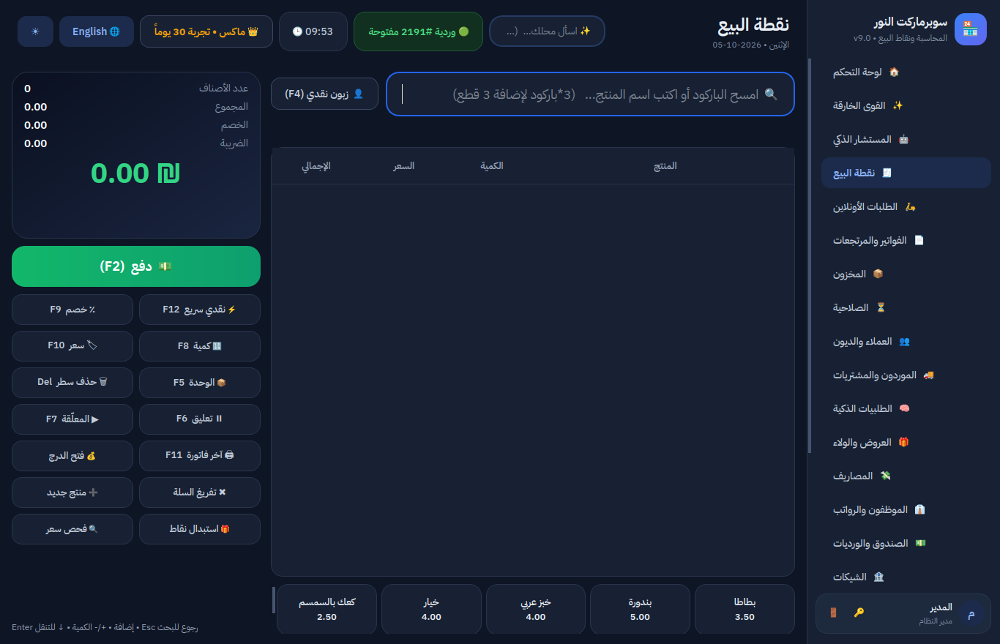 |

<p align="center"> &nbsp; 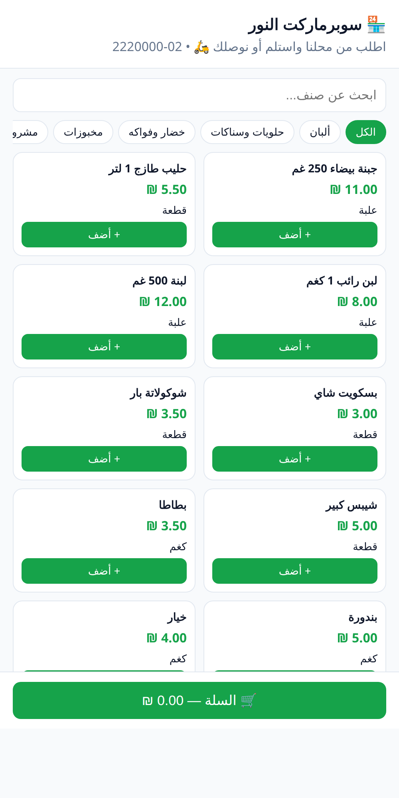</p>

## ⭐ التقييم

| | |
|---|---|
| **المزايا والمحاسبة** | **10 / 10** |
| **الجاهزية للبيع** | **9.5 / 10** — يبقى شيء واحد خارج البرمجة: تجربة ناجحة في 3 محلات حقيقية |

التقييم الكامل حسب كل مجال، ونتائج اختبار التحمّل، وما يبقى قبل البيع الواسع: [تقييم البرنامج](docs/01_تقييم_البرنامج.md).

## 🚀 ابدأ من هنا

| الخطوة | ماذا تفعل |
|---|---|
| **1. نزّل البرنامج** | من روابط التحميل أعلاه، أو من [صفحة آخر إصدار](https://github.com/abdulrahmanahmedelabed-prog/shopping/releases/latest) |
| **2. تدرّب** | افتح «نسخة التدريب» من قائمة ابدأ وجرّب كل شيء على بيانات 3 سنوات — [دليل التدريب](docs/03_دليل_التدريب.md) |
| **3. جهّز التفعيل** | شغّل `LicenseManager.exe` من صفحة الإصدارات ← «📥 استيراد مفتاحي» (مرة واحدة) — [دليل التفعيل](docs/07_دليل_التفعيل.md) |
| **4. بِع** | [دليل التسويق والبيع](docs/05_دليل_التسويق_والبيع.md)، والفيديو والإنفوجرافيك أعلاه |

## 📚 الأدلة

| الدليل | لمن |
|---|---|
| [مزايا البرنامج](docs/00_مزايا_البرنامج.md) | الزبائن |
| [المقارنة مع المنافسين](docs/08_المقارنة_مع_المنافسين.md) | الزبائن وأنت |
| [دليل التدريب الشامل](docs/03_دليل_التدريب.md) | صاحب المحل، المدير، الكاشير |
| [بطاقة الكاشير (للطباعة)](docs/04_بطاقة_الكاشير.md) | الكاشير |
| [المحاسبة ببساطة](docs/02_المحاسبة_ببساطة.md) | صاحب المحل (بدون خلفية محاسبية) |
| [تقييم البرنامج](docs/01_تقييم_البرنامج.md) | أنت (المزوّد) |
| [دليل التفعيل](docs/07_دليل_التفعيل.md) | أنت (المزوّد) |
| [دليل التسويق والبيع + خطة تدريب الزبائن](docs/05_دليل_التسويق_والبيع.md) | أنت (المزوّد) |
| [دليل المطوّر: البناء والتركيب والنشر](docs/06_دليل_المطور_للبناء_والترخيص.md) | أنت (المزوّد) |
| [Product sheet (English)](docs/Product_Sheet_EN.md) | الزبائن خارج البلاد العربية |
| **English guides:** [Training guide](docs/en/Training_Guide.md) • [Cashier card](docs/en/Cashier_Card.md) • [Accounting made simple](docs/en/Accounting_Made_Simple.md) • [How we compare](docs/en/Competitor_Comparison.md) | المستخدمون بالواجهة الإنجليزية |

> شاشة **❓ المساعدة** داخل البرنامج تعرض للزبون أدلته بلغة الواجهة: بطاقة الكاشير، التدريب، المزايا، المحاسبة ببساطة، والمقارنة مع المنافسين — بالعربية، أو بالإنجليزية كاملة عند تبديل اللغة.

---

## للمطوّر

### التشغيل من الكود
```bash
pip install -r requirements.txt
python main.py            # البرنامج
python main.py --demo     # نسخة التدريب (3 سنوات من البيانات؛ SHOP_DEMO_DAYS=90 لمدة أقصر)
```

### الاختبارات
```bash
pip install pytest
python -m pytest tests
```

### هيكل المشروع
```
main.py                 التشغيل
core/                   المنطق (بيع، مخزون، ديون، محاسبة، تدقيق، رواتب، فروع، باقات وترخيص، شبكة،
                        اسأل محلك assistant، التنبؤ forecast، المواسم seasons والتقويم الهجري hijri، الزكاة zakat) بدون واجهة
ui/                     الشاشات (PySide6)، التصميم في ui/style.py والوضع الداكن في ui/theme.py والخط في ui/fonts (رخصة OFL)
docs/                   الأدلة (تُعرض أيضاً داخل البرنامج)
i18n/                   الترجمة الإنجليزية
android/                تطبيق أندرويد
installer/              ملف التثبيت (Inno Setup)
marketing/ad/           الفيديو الإعلاني وأداة إنتاجه (مع المؤثرات الصوتية)
marketing/infographic/  الإنفوجرافيك (منشور، قصة، A4)
tools/                  أدوات المطوّر (مدير التفعيل، البيانات التجريبية، اختبار التحمّل، جسر جهاز البطاقة)
tests/                  الاختبارات
```

### نشر إصدار جديد
من GitHub: **Actions** ← «Windows build (EXE + Setup)» ← **Run workflow** ← رقم الإصدار (مثل `v10.4`)، ونفس الشيء مع «Android app (APK)». خلال دقائق تظهر الملفات في **Releases** وتنزّلها روابط التحميل أعلاه.

التفاصيل في [دليل المطوّر](docs/06_دليل_المطور_للبناء_والترخيص.md).
