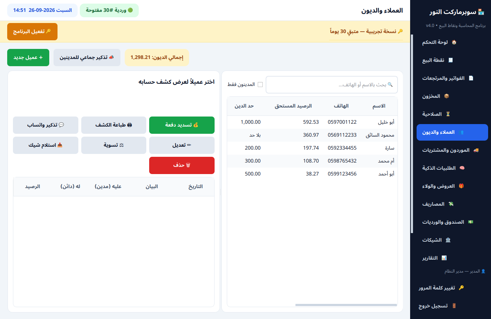
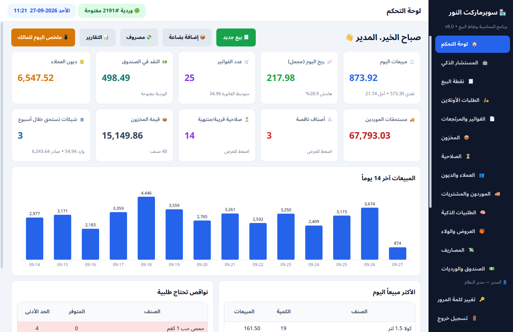
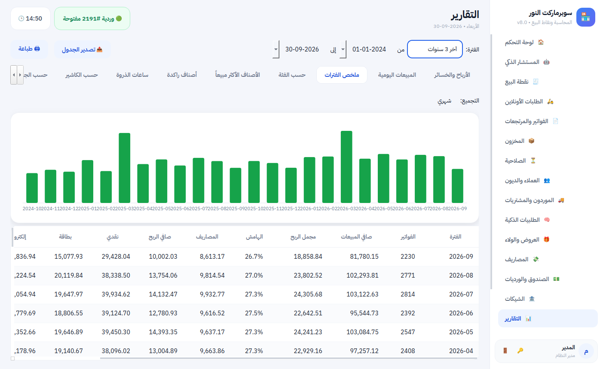
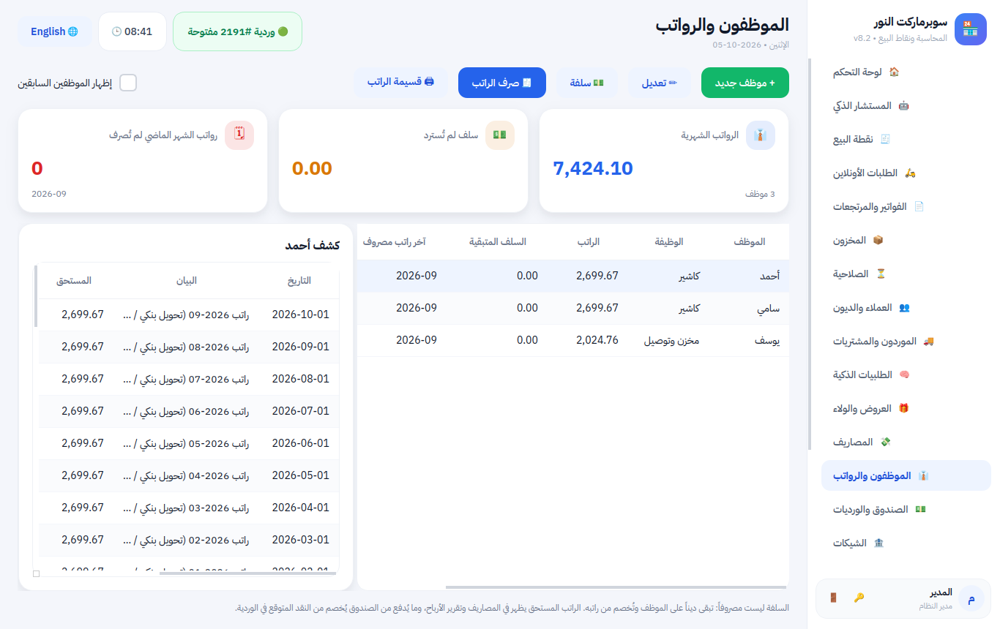
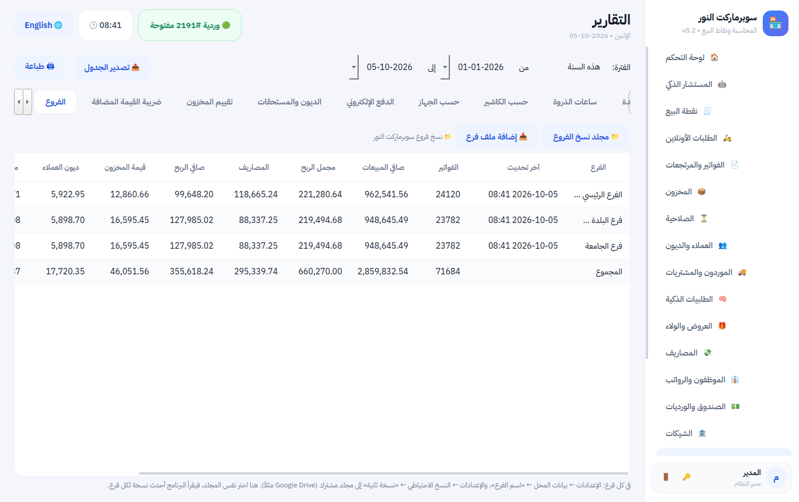
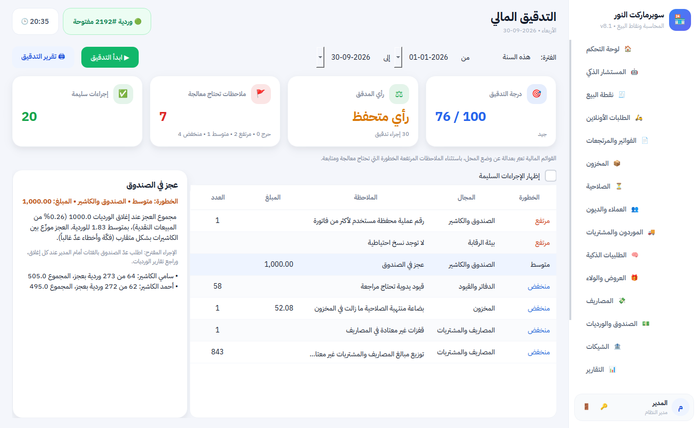

# مزايا البرنامج

**برنامج بيع ومحاسبة لمحلك: يعمل بدون إنترنت، يبيع بسرعة، يتذكر الديون والشيكات والصلاحية عنك، ويقول لك كل يوم كم ربحت فعلاً.**

## 🧾 البيع
- بيع سريع بالباركود أو بالاسم، و`3*` لإضافة عدة قطع مرة واحدة.
- الميزان: يقرأ الوزن والسعر من ملصق الميزان. وأزرار سريعة للأصناف بلا باركود (خبز، خضار).
- الحبة والكرتونة بباركود وسعر لكل منهما.
- الدفع نقداً أو بطاقة أو **محفظة إلكترونية وتطبيق بنكي** أو آجل، أو بعملة أخرى، أو مختلط، مع حساب الباقي.
- جاهز للربط مع جهاز البطاقة البنكي: المبلغ ينتقل للجهاز تلقائياً ويُطبع رقم الموافقة على الإيصال.
- العروض (اشترِ 2 واحصل على 1، 3 بـ 10، خصم على فئة) تُطبَّق وحدها.
- نقاط ولاء للزبائن الدائمين، وأسعار جملة لتجار الجملة.
- تعليق الفاتورة وخدمة زبون آخر، فحص السعر، إعادة طباعة آخر فاتورة.
- إيصال بشعار محلك، ورمز QR للفاتورة الضريبية إن احتجته.
- شاشة للزبون تعرض الأصناف والتوفير والباقي، ووضع خاص لشاشات اللمس.

## 📲 المحافظ الإلكترونية وتطبيقات البنوك
- عرّف مرة واحدة الطرق التي يدفع بها زبائنك (مثل PalPay وJawwal Pay والتحويل البنكي الفوري وCliQ وInstaPay...)، واختر أين يصل المال: رصيد المحفظة أو البنك مباشرة.
- عند الدفع: زر واحد يعرض للزبون **رقم حسابك ورمز QR** على الشاشة وشاشة الزبون، ويسجّل **رقم العملية** من إشعاره.
- **تقرير المطابقة:** مجموع كل طريقة وعملياتها سطراً بسطر لمقارنتها مع كشف المحفظة أو البنك.
- الزبون يسدد دينه بالمحفظة أيضاً، وتحويل رصيد المحفظة للبنك وعمولاتها عمليات جاهزة بضغطة.
- محاسبياً: حساب خاص «المحافظ الإلكترونية» في الميزانية، والدفع الإلكتروني لا يختلط بنقد الدرج.

## 📦 المخزون والصلاحية
- يبيع الأقرب انتهاءً أولاً، وينبهك قبل انتهاء الصلاحية، ويمنع بيع المنتهي.
- جرد من الكمبيوتر أو من الجوال بكاميرا الباركود.
- استيراد الأصناف من Excel، وطباعة ملصقات الأسعار.
- **الطلبيات الذكية:** البرنامج يحسب ما ينقص حسب سرعة البيع، ويرسل الطلبية للمورد بواتساب.
- مرتجع للمورد، وحركة كاملة لكل صنف.

## 👥 الديون والشيكات
- دفتر ديون لكل زبون بكشف حساب مطبوع، وحد للدين.
- تذكير واتساب لزبون واحد أو لكل المدينين بضغطة.
- نقل دفتر الديون القديم من Excel في دقيقة.
- الشيكات الواردة والصادرة مع تنبيه قبل الاستحقاق، وإذا رجع الشيك يعود الدين تلقائياً.

## 💰 الأرباح والمحاسبة
- لوحة تحكم: مبيعات اليوم، الربح، النقد في الدرج، الديون، النواقص.
- **الربح الحقيقي** بعد التكلفة والمصاريف والتالف وعجز الصندوق.
- **ملخص يومي وأسبوعي وشهري وسنوي**: المبيعات والربح والمصاريف وطرق الدفع لكل فترة، ومجموعها يطابق تقرير الأرباح بالضبط.
- تقارير: الأكثر ربحاً، الراكد، ساعات الذروة، حسب الكاشير، الدفع الإلكتروني، إقرار ضريبة القيمة المضافة.
- ميزانية عمومية وميزان مراجعة ودفتر يومية (قيد مبيعات يومي واحد أو قيد لكل فاتورة) جاهزة للمحاسب، بدون أن تحتاج أنت لمعرفة المحاسبة.
- سريع مع سنوات من البيانات: كل التقارير على 3 سنوات من مبيعات سوبرماركت تظهر في أقل من ثانية.

## 👔 الموظفون والرواتب والأقساط

- **الرواتب:** راتب شهري لكل موظف، مكافآت وخصومات، **سلف تُخصم من الراتب تلقائياً**، وقسيمة راتب للطباعة. كل ذلك في المصاريف والأرباح والصندوق بلا جهد.
- **تقسيط ديون الزبائن:** جدول أقساط بمواعيد، يتابع المسدَّد والمتأخر وحده، ويذكّر الزبون بقسطه بالواتساب.

## 🏬 الفروع والسلاسل

كل فرع يعمل باستقلال حتى لو انقطع الإنترنت، والمالك يرى **الفروع كلها في تقرير واحد**: مبيعات وأرباح ومصاريف ومخزون وديون كل فرع ومجموعها، من مجلد مشترك على Google Drive.

## 🔎 التدقيق المالي بضغطة زر

- **مدقق مالي داخل البرنامج:** 33 إجراء تدقيق على كل عملية مسجّلة (وليس على عيّنة): توازن الدفاتر، مطابقة ديون العملاء والموردين والمخزون مع الأستاذ، تسلسل الفواتير بلا أرقام مفقودة، سلامة كل فاتورة.
- **كشف التلاعب:** مرتجع نقدي لفاتورة دُفعت ببطاقة، إشعار تحويل مستخدم مرتين، عجز صندوق يتكرر عند كاشير، خصومات ومرتجعات غير طبيعية، فتح الدرج بلا بيع، مصاريف مكررة، وقانون بنفورد لكشف المبالغ المختلقة.
- **أعمار الديون** مع مخصص مقترح للديون المشكوك فيها، والبضاعة المنتهية والراكدة، وتقلبات هامش الربح، وتسوية الضريبة، والنسخ الاحتياطي.
- **تقرير تدقيق للطباعة** برأي (نظيف / متحفظ / سلبي) ودرجة من 100، ولكل ملاحظة إجراء مقترح.

## 🤖 المستشار الذكي
كل صباح يخبرك بما يحتاج انتباهك: صنف رابح سينفد، صنف تبيعه بخسارة، بضاعة راكدة، زبون توقف عن الشراء، عجز متكرر في الصندوق — مع رابط للإجراء المناسب.

## 🔒 الرقابة والأمان
- ورديات لكل كاشير وعدّ للصندوق يكشف أي عجز أو زيادة.
- الخصم الكبير وتغيير السعر يحتاجان إذن المدير.
- سجل لكل عملية: من غيّر سعراً، ومن فتح الدرج، ومتى.
- نسخة احتياطية تلقائية كل يوم، ونسخة ثانية في Google Drive أو OneDrive.
- **بياناتك ملكك:** إذا انتهى الاشتراك يتوقف البيع فقط، وتبقى التقارير والديون متاحة.

## 📱 الجوال والأونلاين
- **تطبيق أندرويد:** يُربط بمحلك بمسح رمز QR؛ فيه الأسعار والجرد بالكاميرا ولوحة المالك.
- **لوحة المالك:** مبيعات اليوم وربحه والنقد والتنبيهات من جوالك.
- **متجر أونلاين** يطلب منه زبائنك من جوالاتهم (استلام أو توصيل)، والطلب يتحول لفاتورة بضغطة — بلا عمولة لأحد.
- ملخص اليوم على واتساب المالك.

## 🖥 يناسب محلك، صغيراً أو كبيراً
- **دكان صغير:** الوضع المبسّط يعرض البيع والمخزون والديون والتقارير فقط.
- **سوبرماركت ومحل كبير:** عدة أجهزة كاشير على شبكة المحل، ورديات لكل كاشير، والبيع يستمر إذا انقطعت الشبكة، وأداء سريع مع مئات الآلاف من الفواتير.
- **يعمل بدون إنترنت** دائماً.
- بالعربية والإنجليزية.
- **نسخة تدريب:** سوبرماركت كامل بتاريخ 3 سنوات (مواسم، رمضان، نمو، كل طرق الدفع) لتعليم الموظفين وتجربة التقارير اليومية والأسبوعية والشهرية والسنوية، دون المساس ببيانات المحل.
