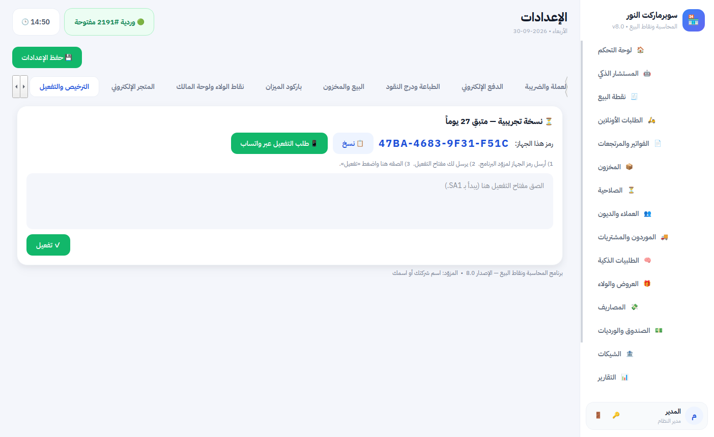
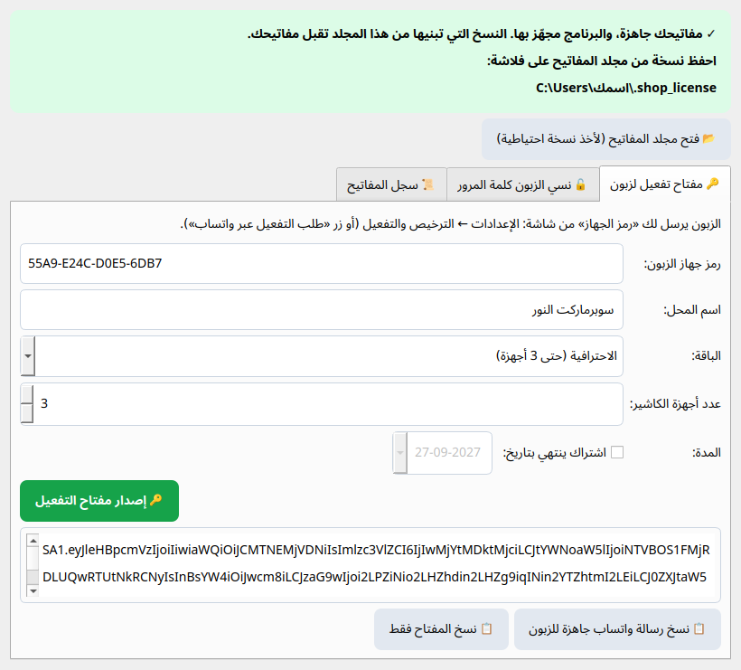

# دليل التفعيل (لك أنت كمزوّد)

> **الفكرة ببساطة:** البرنامج يعمل عند الزبون أول 30 يوماً بباقة **ماكس** كاملة مجاناً، ثم ينتقل للباقة **المجانية** ويستمر يبيع. للترقية إلى **بلس** أو **برو** أو **ماكس** يحتاج «مفتاح تفعيل» خاصاً بجهازه، **لا يستطيع أحد غيرك إصداره**. تصدره أنت من نافذة **«مدير التفعيل»** في دقيقة.

---

## أولاً: التجهيز (مرة واحدة فقط في حياتك)

### 1. اكتب اسمك ورقمك في البرنامج
الملف `core\vendor.py` مضبوط باسم الشركة ورقمها:
```
VENDOR_NAME = "شركة الحسن للبرمجة والدعاية"
VENDOR_OWNER = "عبد الرحمن العابد"
VENDOR_PHONE = "970592458157"      ← رقم واتساب بالصيغة الدولية بدون + وبدون أصفار في أوله
```
لتغييرها لاحقاً افتح الملف بالمفكرة (Notepad) وعدّل هذه الأسطر.
بهذا يصلك طلب التفعيل من الزبون على واتسابك مباشرة، ويظهر اسمك ورقمك في شاشة المساعدة.

### 2. استورد مفتاحك الخاص (مرة واحدة على كل كمبيوتر تصدر منه المفاتيح)
البرنامج **مجهّز مسبقاً** بمفتاحك العام، وملف مفتاحك الخاص `private_key.json` وصلك مع هذا الإصدار.
1. انقر مرتين على **`license_manager.bat`** في مجلد البرنامج (يحتاج Python على كمبيوترك).
2. اضغط **📥 استيراد مفتاحي** واختر ملف `private_key.json`.
3. تظهر رسالة خضراء: «مفاتيحك جاهزة، والبرنامج مجهّز بها».

> **لا تضغط «إنشاء مفاتيحي»**: البرنامج المنشور مبني على مفتاحك الحالي، ومفتاح جديد لن يطابقه (لذلك يُخفى الزر ما دام البرنامج مجهّزاً بمفتاح).

### 3. خذ نسخة احتياطية من مفتاحك — مهم جداً
احفظ ملف `private_key.json` في مكانين آمنين على الأقل (فلاشة + بريدك أو Google Drive)، مثل ملف مفتاح توقيع تطبيق الجوال.
- **إذا ضاع لن تستطيع إصدار مفاتيح جديدة للنسخ التي بعتها.**
- لا ترسله لأحد، ولا ترفعه على GitHub.
- كمبيوتر جديد؟ شغّل `license_manager.bat` عليه واضغط **📥 استيراد مفتاحي** من جديد.

### 4. النسخ المنشورة جاهزة
كل نسخ البرنامج من الإصدار 10.4 فأحدث (ملف التثبيت والنسخة المحمولة من صفحة الإصدارات) تقبل المفاتيح التي تصدرها. نسخة أقدم عند زبون لا تقبل أي مفتاح وتظهر له رسالة «لم يُجهَّز البرنامج بمفتاح الترخيص»؛ الحل: ثبّت فوقها النسخة الجديدة، وبياناته لا تتأثر.

---

## ثانياً: تفعيل زبون (كل مرة، دقيقة واحدة)

### الخطوة 1 — الزبون يرسل لك رمز جهازه
عند الزبون: زر **💎 الباقات والترقية** ← **«اطلب برو»** مثلاً (تصلك رسالة فيها الباقة ورمز الجهاز)، أو الإعدادات ← **الترخيص والتفعيل** ← **📱 طلب التفعيل عبر واتساب**.
تصلك رسالة فيها اسم المحل و**رمز الجهاز** (مثل `55A9-E24C-D0E5-6DB7`).



### الخطوة 2 — أنت تصدر المفتاح
1. افتح **`license_manager.bat`** ← تبويب **🔑 مفتاح تفعيل لزبون**.
2. الصق **رمز الجهاز**، واكتب **اسم المحل**.
3. اختر **الباقة** (⚡ بلس / 💎 برو / 👑 ماكس) — يُضبط **عدد أجهزة الكاشير** حسبها تلقائياً (2 / 5 / غير محدود)، ويمكنك تغييره.
4. للاشتراك فقط: ضع علامة **«اشتراك ينتهي بتاريخ»** واختر التاريخ. للشراء الدائم اتركها فارغة.
5. اضغط **🔑 إصدار مفتاح التفعيل**.
6. اضغط **📋 نسخ رسالة واتساب جاهزة للزبون** والصقها له في واتساب. الرسالة فيها المفتاح وطريقة التفعيل.



### الخطوة 3 — الزبون يفعّل
يلصق المفتاح في شاشة الترخيص والتفعيل ويضغط **✓ تفعيل**. يختفي الشريط البرتقالي، وانتهى الأمر.

---

## حالات شائعة

| الحالة | ماذا تفعل |
|---|---|
| **تجديد اشتراك** | أصدر مفتاحاً جديداً لنفس رمز الجهاز بتاريخ الانتهاء الجديد |
| **الزبون يريد أجهزة كاشير أكثر** | أصدر مفتاحاً جديداً لنفس رمز الجهاز بعدد أجهزة أكبر |
| **الزبون غيّر الكمبيوتر أو أعاد تثبيت ويندوز** | يتغير رمز الجهاز: اطلب الرمز الجديد وأصدر له مفتاحاً |
| **المحل فيه عدة كاشيرات** | فعّل **الجهاز الرئيسي فقط**؛ الأجهزة الأخرى تتبعه تلقائياً |
| **نسي الزبون كلمة مرور المدير** | يضغط «نسيت كلمة المرور؟» في شاشة الدخول ويرسل لك رمز جهازه. في «مدير التفعيل» ← تبويب **🔓 نسي الزبون كلمة المرور** ← الصق الرمز ← **إصدار رمز الاستعادة** ← أرسله له. صالح 3 أيام ولمرة واحدة. **تأكد أنه صاحب المحل قبل إرساله** |
| **تريد معرفة من فعّلت له** | تبويب **📜 سجل المفاتيح**: كل مفتاح أصدرته بتاريخه ومحله وباقته |
| **الزبون لم يدفع بعد** | لا تفعل شيئاً: يعمل 30 يوماً بباقة ماكس، ثم ينتقل للمجانية ويستمر يبيع، والميزات المتقدمة تظهر له مقفلة مع زر «اطلب» يصلك على واتساب |
| **زبون قديم بمفتاح «الأساسية/الاحترافية/الشاملة»** | مفتاحه يبقى صالحاً ويُقرأ: الأساسية ← بلس، الاحترافية والاشتراك ← برو، الشاملة ← ماكس |
| **انتهى اشتراكه ولم يجدد** | يعود للمجانية تلقائياً ويستمر البيع؛ عند التجديد أصدر مفتاحاً بتاريخ جديد فتعود ميزاته فوراً |

## رسائل قد يراها الزبون

| الرسالة | السبب والحل |
|---|---|
| «لم يُجهَّز البرنامج بمفتاح الترخيص بعد» | النسخة المثبتة بُنيت قبل إنشاء مفاتيحك. ثبّت فوقها نسخة مبنية بعد إنشاء المفاتيح |
| «مفتاح التفعيل غير صالح» | المفتاح ناقص (لم يُنسخ كاملاً)، أو النسخة المثبتة بُنيت بمفاتيح أخرى (من جهاز آخر أو قبل إعادة إنشاء المفاتيح) |
| «هذا المفتاح صادر لجهاز آخر» | رمز الجهاز الذي أصدرت له المفتاح غير رمز هذا الجهاز. اطلب الرمز الظاهر في شاشته الآن |
| «هذا المفتاح منتهي الصلاحية» | تاريخ الاشتراك في المفتاح مضى. أصدر مفتاحاً بتاريخ جديد |
| «وصلت للحد الأقصى من الأجهزة المرخّصة» | عدد أجهزة الكاشير أكبر من الباقة. أصدر مفتاحاً بعدد أكبر |
