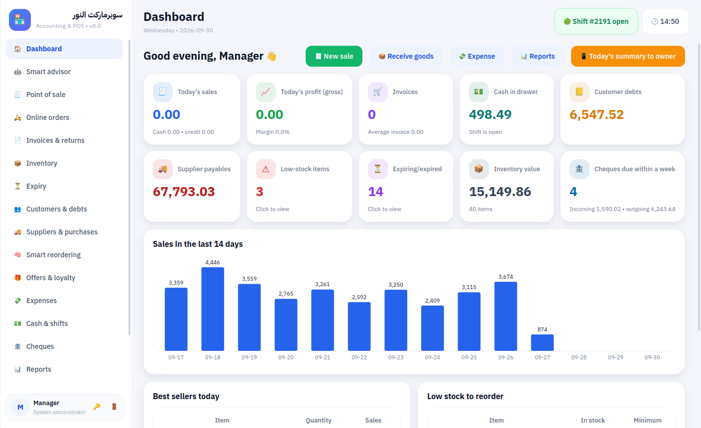
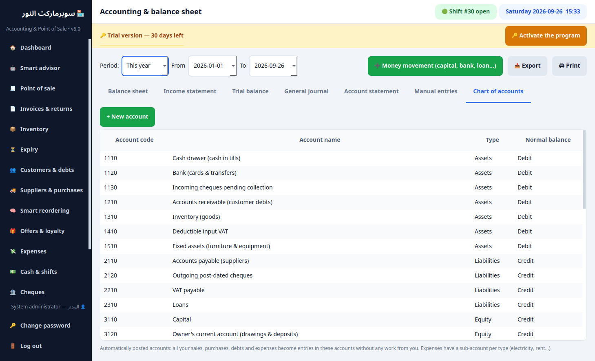
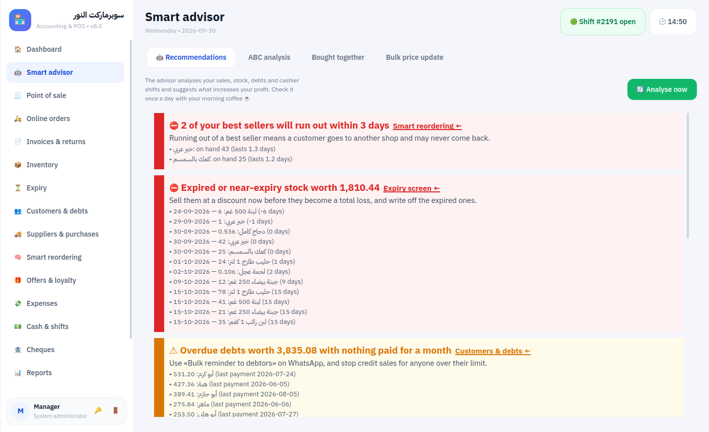

# Shop Accounting & POS — Product Sheet

**Point of sale + real accounting for grocery stores, mini-markets and small supermarkets.**
Works fully offline on your own computer, in **English and Arabic**. **Free forever plan**, then Plus, Pro and Max — and **your first month is the full Max plan, free.**

## Superpowers
- **Ask your shop** — type a question the way you'd ask your accountant (English, Arabic or Arabic dialect): “sales yesterday?”, “who owes me money?”, “how much milk is left?”, “compare this month with last month”, “what should I prepare for Ramadan?”. Instant answers from your own data, offline. Ctrl+K from any screen.
- **Sales & cash-flow forecast** — next 30 days day by day with a confidence band; expected cash including salaries, cheques, purchases and collections, with a warning before cash runs short.
- **Seasons & Ramadan planner** — Hijri calendar: Ramadan, both Eids, back to school and summer, with last season's uplift per item, a first-order quantity and an order-by date.
- **Zakat calculator** — zakat on trade goods straight from the books, nisab by gold price, Hijri or Gregorian year, next zakat date and a printable report.
- **Dark, light or auto theme**, and **your logo** on every screen and every printout.

## Why shop owners choose it
- **Fast checkout** — barcode, weighing-scale labels, cartons vs. pieces, hold/recall, quick keys, `3*barcode`.
- **Never stops selling** — no internet needed. With several tills, cashiers keep selling even if the main computer goes down; sales sync automatically, without duplicates.
- **Know your real profit** — cost of goods, discounts, returns, expenses, write-offs and cash shortages are all included. Automatic double-entry accounting gives you an income statement, balance sheet and trial balance without typing a single journal entry.
- **Smart advisor** — every morning: items sold at a loss, best sellers about to run out, dead stock, customers who stopped coming, late debts, unusual cashier discounts, peak hours, items bought together.
- **Customer credit & post-dated cheques** — statements, credit limits, WhatsApp reminders, cheque due-date alerts, bounced cheques restore the debt automatically.
- **Inventory done right** — batches & expiry dates (first-expiry-first-out), stock counts, loss tracking, returns to suppliers, ABC analysis, smart reorder suggestions sent to suppliers on WhatsApp.
- **Grow sales** — automatic offers (buy X get Y, bundle price, % off a category), loyalty points, wholesale price levels, bulk price updates by target margin.
- **Control** — cashier shifts with cash counting, manager approval for sensitive actions, full activity log, server-side permission checks.
- **Owner on the go** — dashboard on the owner's phone and a daily WhatsApp summary.
- **VAT ready** — output and input VAT with a VAT return report, and an e-invoice QR code on receipts (Saudi simplified tax invoice format).
- **Online ordering** — a mobile store page for pickup or delivery orders; orders become POS invoices in one click. No commissions to delivery apps.
- **Android app** — pairs with the shop by scanning a QR code: price, stock and expiry lookup, shelf counts with the phone camera, and the owner dashboard.
- **Card terminal ready** — sends the amount to the bank card terminal and prints the approval code on the receipt (bank-specific connection required).
- **Simple mode & touch screens** — a lighter layout for small corner shops, big buttons and an on-screen keypad for touch tills.
- **Easy switch** — import your old credit book (customers, suppliers and balances) from Excel in a minute.
- **E-wallets & banking apps** — one tap per method (e.g. instant bank transfer, mobile wallets): shows your account and QR code to the customer, records the transaction number, keeps a separate e-wallet account in the books, and a reconciliation report per method.
- **Daily, weekly, monthly and yearly summaries** — sales, profit, expenses and payment mix per period, adding up exactly to the profit report.
- **Training copy with 3 years of data** — a complete supermarket history to train staff and explore reports without touching real data.
- **Multi-currency cash** — accept cash in other currencies at your exchange rate.
- **Your data stays yours** — stored on your computer with daily backups and an optional cloud copy (Google Drive / OneDrive).
- **Built-in financial auditor** — 37 audit procedures on every transaction (not a sample): ledger reconciliations, document sequence gaps, cashier fraud indicators (cash refunds on card sales, reused wallet references, repeated shortages), debt aging with a doubtful-debt allowance, Benford's law, data-file integrity. Gives a clean/qualified/adverse opinion, a score out of 100 and a printable report.
- **Payroll** — monthly salaries, bonuses and deductions, advances deducted automatically from the next salary, printable payslips, all flowing into expenses, profit and the cash drawer.
- **Customer installments** — split a customer's debt into a dated schedule; payments are applied to the oldest installment, overdue ones trigger advisor alerts and WhatsApp reminders.
- **Branches & chains** — each branch works independently; the owner sees every branch and the total in one report, read from a shared Google Drive folder.
- **Fits any screen, any language** — modern mobile-app style interface that adapts to small laptops, and switches between Arabic and English instantly.

| | |
|---|---|
|  |  |
|  |  |

## Plans (yearly, USD) — less than half the price of the matching global product
| Plan | Tills | Per year | Matching global product (per year) | Adds |
|---|---|---|---|---|
| 🌱 Free | 1 | **$0 forever** | — | POS, inventory & expiry, customer/supplier debts, cards & e-wallets, shifts, reports & VAT, mobile price-check app |
| ⚡ Plus | 2 | **$290** (≈ $24/mo) | Square Plus $588 | Smart advisor, smart reorder, offers & loyalty, cheques, installments, stock counting from phone |
| 💎 Pro | 5 | **$890** (≈ $74/mo) | Lightspeed Retail Core $1,788 | Accounting & balance sheet, accountant autopilot, financial audit, payroll, online store, owner dashboard, zakat |
| 👑 Max | unlimited | **$1,730** (≈ $144/mo) | Lightspeed Retail Plus $3,468 | Ask your shop, forecasting, seasons planner, branches |

**First 30 days: the full Max plan, free.** Afterwards the program moves to Free — **selling never stops** and your data is never locked. See [how we compare](en/Competitor_Comparison.md) with 11 Arab and global products.

## Requirements
Windows 10/11 PC, any thermal receipt printer (58/80 mm), USB barcode scanner, optional cash drawer and customer display. Multiple tills connect over the shop's local network.

**Contact:** _your name — WhatsApp — email — website_
